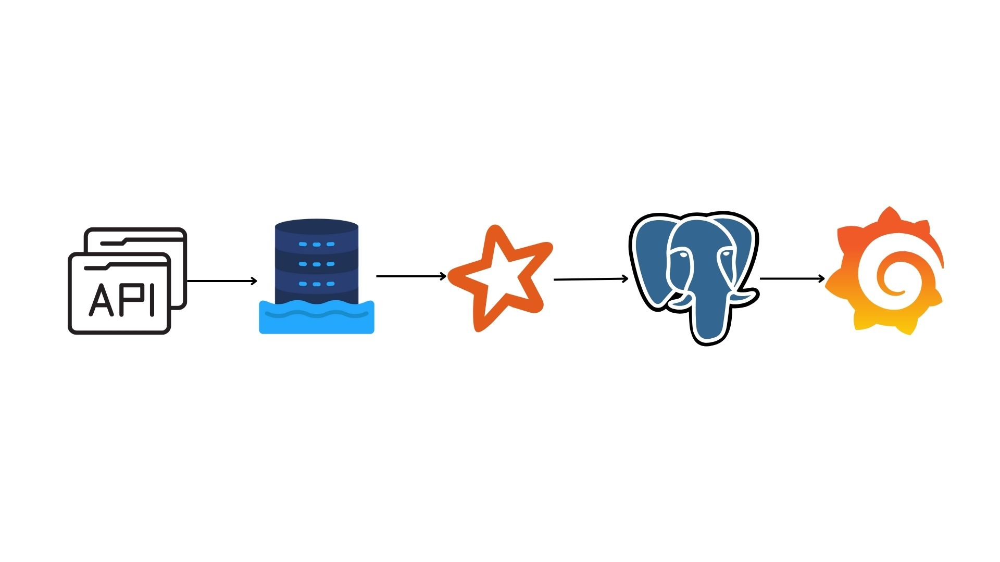

# Overview



- **API**: We are using as https://docs.fastf1.dev/index.html  our data source, which supports Python, and that’s the choice of language in this project.
- **Datalake**: A datalake is mimicked by a location on the host computer `/datalake/scheduling_raw`
- **Apache Spark**: This is our processing engine, it takes raw output, cleans and converts it into a structured and efficient format for analysis and warehousing.
- **PostgreSQL** is our data warehouse. It stores data in tabular format and is a good tool for data integrity because it has a schema on write.
- Grafana: This is our visualisation tool, as it’s free and can be set up on a Docker machine without a user having to meddle with it.
- We’re following the Medallion architecture here, so the lake contains the Bronze layer, and PostgreSQL contains the Silver and Gold layers.

# Housekeeping

These are all the scripts under `/init` folder. They all run automatically as soon as you build a Docker container.

## Infrastructure creation

This is just one script `/init/docker-compose.yml` . This sets up multiple Docker containers to run each of the tasks in the pipeline without interfering with each other. Keeping them in separate containers ensures that there’s no monopoly of any application, since we’re running applications of different requirements.

Making even the simplest task in a Docker container ensures that the user only needs to install Docker, and everything else is handled by the scripts in the repository.

Command to run this:

```bash
docker-compose -f init/docker-compose.yml up -d
```

## Data ingestion housekeeping

This mainly just contains fulfilling any dependencies that our Python container might need. If you need something to be installed on the Python container, just add it to the text file `init/scripts/pythonDependencies.txt` and don’t forget to add a new line in then end.

```
fastf1
pandas
numpy

```

The above is a sample of how you can add more modules. Once done, rerun the docker build and you’ll have it installed.

These are all installed by this script `/init/scripts/install_missing_modules.py`

## Data warehouse housekeeping

These are DDL scripts stored under `init/SQL/combined` . 

Please note that they are sorted by name, so you need to make sure how you want to run your scripts, because there are dependencies that PostgreSQL has that need to be met, like a foreign key constraint. 

So, you should always place a dimension table DDL before fact tables, so that you can create a dependency of the fact table on the dimension table.

# Data Ingestion

This is where our entire system connects with an external source to fetch the data we need from it.

Our source is https://docs.fastf1.dev/index.html you can dive deeper into it to understand how to use it better by following the link.

All the ingestion scripts are placed under `/ingestion_scripts` folder in the repository. You will understand the kind of data that they ingest by the names of the scripts.

## Schedule data ingestion

This is done by a Python file `/ingestion_scripts/schedule_api_dumps.py` 

Usage of the script:

```bash
docker exec python_f1 python /app/schedule_api_dumps.py 01-09-2019 /data/scheduling_raw/
```

As we’re using a Docker container to run the scripts, we’ll invoke it through Docker.

**Arguments:**

- The date is always supposed to be in DD-MM-YYYY format. The script then produces a file for the next year, so in the command shown above, it’s the 2020 schedule being extracted. I plan on making a schedule job around it on 1st Sept of every year because usually by that time, we have the next year’s official schedule
- The location of the scripts isn’t seen in the repository because these are Docker volumes, it’s the same script`/app/schedule_api_dumps.py` = `/ingestion_scripts/schedule_api_dumps.py`
- Similarly, `/data/scheduling_raw/` = `/datalake/scheduling_raw` is the target location.

**Working:**

1. It looks for the schedule by connecting to the Internet, and then connects to the API
2. If it does not find the schedule, it fails.
3. The API mainly fetches all the data in the form of a dataframe in pandas
4. We use pandas to create the output file with a delimiter as <#??#>

# Data transformation

These are all the files under `/transform_and_load`. This ensures that all the transformation load is taken off the data warehouse and compute is isolated; this way, you can query the data warehouse more intensely for analytic purposes, as it is never doing the heavy lifting of transformation. Using Spark is an overkill, but this is a portfolio project, too, so I wanted to add Spark to the pipeline. The folder contains 3 folders:

- script: It contains PySpark scripts, which run on the Spark Docker container.
- config: These are files that help with configuring the Spark job. From here, you can choose the property files you want to read, the target source location, the delimiter, etc.
- properties: This contains property files, which are transformation SQL.

## Transforming schedule data

You can run the script using this command:

```bash
docker exec spark_f1 spark-submit /opt/spark_jobs/script/schedule_transformer.py 01-09-2019 /opt/spark_jobs/config/schedule.config
```

Arguments:

- The date argument needs to be in DD-MM-YYYY format, and then it runs for the next year.
- `/opt/spark_jobs` is a volume in the Spark container mapped to `/transform_and_load`
- `/opt/spark_jobs/config/schedule.config` is the location of the configuration file.

**Working:**

1. It checks the config file to look for the source path of the data, the file pattern, the delimiter used in the source file, the raw table name and the location of the property file.
2. The source path always needs to be under `/data`, as this is a Docker volume mounted on it.
3. The file pattern tells the script what kind of pattern the file’s name has. To distinguish between years, we always use `{year}`, which is replaced by the script to find the corresponding year’s file.
4.  The delimiter tells the script about what delimiter is being used between each field in the file.
5. raw table can be set, this allows you to know and also set (in case you don’t like the table name) the raw table name. This is the name that’s given to the raw data that’s supplied to the script, so you can query the data with regular SQL and take that table as the source.
6. property file contains SQL in this format: *target_table_name* |*SQL_query* 
7. The spark job consumes the raw file to create a raw table from which the SQL query will be used to transform the data as per the requirement of the data warehouse and then ingested into the data warehouse.

# Debugging

- How to get into a Docker container:
    - By entering a coder container, you can get to know how a file is seen inside a container
    - Most of these Docker containers are simply Linux machines, so most of the Linux commands like ls, cd, etc, work inside them (Except the PostgreSQL server)

```bash
docker exec -it *container_name* /bin/bash
```